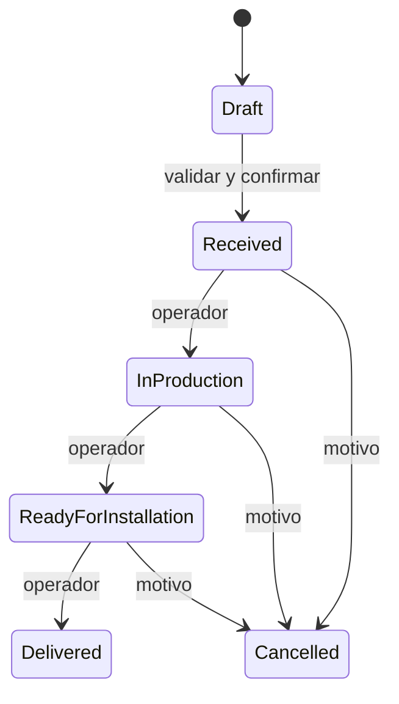

# Máquina de estados

O E-06: Received, In Production, Ready for Installation, Delivered, Cancelled. O E-04: dashboard usa Completed como métrica, no aparece como opción del filtro. Su equivalencia con Delivered no está confirmada.

I: Draft es una entidad separada, no un pedido emitido. Crear pedido válido y confirmado convierte su contenido en Received y archiva borrador en transacción. El grafo siguiente es propuesto, no observado:

Delivered/Cancelled terminales por defecto. No reapertura ni retroceso en MVP sin decisión explícita A-002. Cambio exige permiso, expectedVersion, motivo cuando hay cancelación/corrección, evento auditado y outbox en una transacción. Conflicto 409 obliga recargar/comparar. No se aplicará una transición basándose solo en el estado presentado en el navegador.

Precio pendiente no añade estado de pedido. Cotización tiene versiones separadas draft/published/superseded propuestas; no equivale a pago ni autorización automática para producir. Confirmar con responsable quién puede producir y bajo qué condiciones comerciales.
